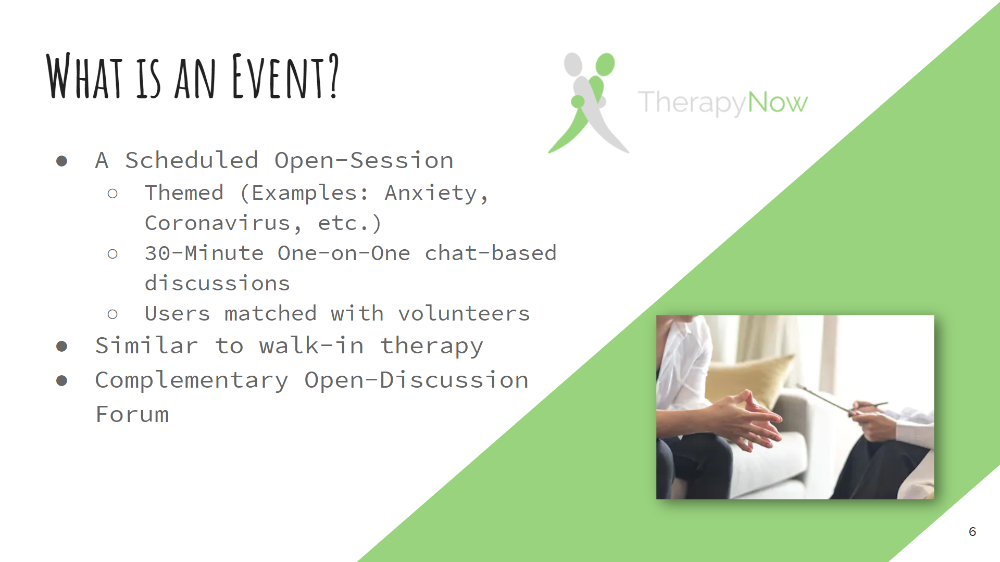

# Events
An event is a scheduled session for users to discuss their stressors, one-on-one, with a counselor. It provides the unique opportunity for a user to get therapy right when they want it, no appointment needed. Each event will have a theme, as well as a start time and end time. Examples of themes could include anxiety, depression, grief, coronavirus, etc. Users are matched with volunteers for 30 minute one-on-one chats. There will also be a large group forum to accompany each event.
## Add a new model
### Add it
1. Go to `TherapyNow/backend/src/events/models.py`
2. Add a `class` and write whatever code in it
### Register it
1. Go to `TherapyNow/backend/src/events/admin.py`
2. Add the name of your newly created class as an additional argument on line 29 of `admin.py` (`admin.site.register(...)`)
### Serialize it
1. Go to `TherapyNow/backend/src/events/serializers.py`
2. Add a `class` in `serializers.py` to serialize your `models.py` class
### Migrate it
1. Save the `models.py`, `admin.py`, and `serializers.py` files
2. In the command line, `migrate` and `makemigrations`
